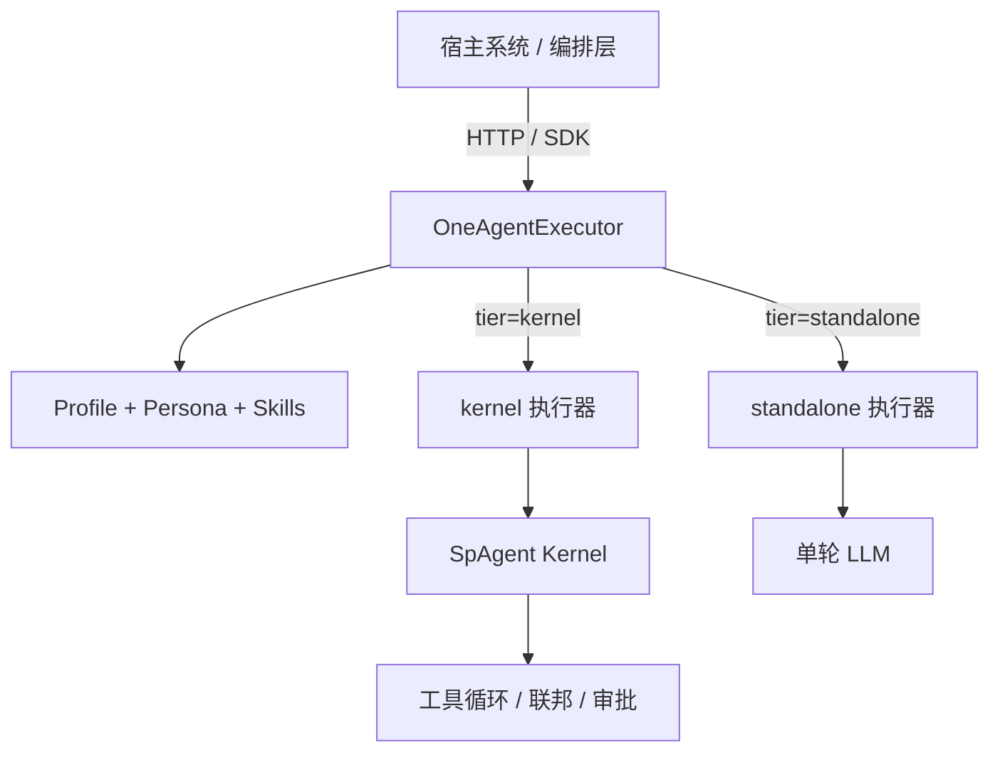

# 双轨执行架构

OneAgent 通过 **执行层级（tier）** 在「自身轻量处理」与「SpAgent 内核协作」之间切换，满足：

- **简单场景**：只用 OneAgent（standalone）
- **复杂场景**：SpAgent 内核处理（kernel）

统一入口：`OneAgentExecutor`（`runtime.executor`）

---

## 架构



| tier | 执行路径 | 适用场景 |
|------|---------|---------|
| **standalone** | Persona + Skills + 单轮 LLM | 问答、文案审阅、轻量 Copilot |
| **kernel** | SpAgent 完整 run-loop | 多步推理、知识检索、宿主动作、联邦 |
| **auto** | 按规则自动选择上述二者 | 编排层默认推荐 |

---

## 路由规则

优先级（高 → 低）：

1. 请求 `body.tier` / `options.tier` / CLI `--tier`
2. `task.metadata.executionTier`
3. Profile `escalateToKernelWhen`（升级规则，优先于 defaultTier）
4. Profile `spec.execution.defaultTier`
5. 全局 `defaults.executionTier`（config，默认 `auto`）
6. `auto` 启发式（`forceKernel`、capabilities + contextRefs 等）

### 升级规则示例

`reviewer` Profile：

```yaml
execution:
  defaultTier: standalone
  escalateToKernelWhen:
    hasContextRefs: true    # 传入业务文档引用 → 自动 kernel
```

无 contextRefs 时 standalone 快速审阅；有 `contextRefs` 时升级 kernel 以调用 HostBridge 解析与工具。

---

## 内置 Agent 默认策略

| Agent | defaultTier | 说明 |
|-------|-------------|------|
| `copilot` | standalone | 通用辅助 |
| `reviewer` | standalone + escalate | 简单审阅轻量；带业务上下文走 kernel |
| `planner` | kernel | 任务规划默认 SpAgent |

---

## SDK 用法

```ts
import { createOneAgentRuntime } from "@compo/oneagent";

const runtime = await createOneAgentRuntime({
  hostBridge: {
    async resolveContext(refs) {
      return mySystem.resolve(refs);
    },
  },
});

// 简单 — 只用 OneAgent
await runtime.executor.run(task, { tier: "standalone" });

// 复杂 — SpAgent 内核
await runtime.executor.run(task, { tier: "kernel" });

// 自动
const result = await runtime.executor.run(task, { agentId: "reviewer" });
console.log(result.executionTier); // "standalone" | "kernel"
```

---

## HTTP 用法

```json
POST /v1/agents/copilot/run
{
  "tier": "standalone",
  "task": {
    "goal": "解释这段代码",
    "actor": { "userId": "u1" }
  }
}
```

响应包含 `executionTier` 字段，便于编排层审计路由决策。

```json
POST /v1/agents/planner/run
{
  "tier": "kernel",
  "task": {
    "goal": "拆解发布流程并检索知识库",
    "actor": { "userId": "u1" }
  }
}
```

流式仅 kernel tier：

```
POST /v1/agents/planner/stream
```

---

## Sidecar 模式

`kernel.mode: sidecar` 时，**仅 kernel tier** 转发至独立 SpAgent Gateway：

```yaml
kernel:
  mode: sidecar
  spagentUrl: http://127.0.0.1:8787
```

| tier | 执行位置 |
|------|---------|
| standalone | OneAgent 进程 |
| kernel | SpAgent Gateway（HTTP 转发） |

适合 OneAgent 轻量多实例 + SpAgent 集中扩缩容。**Sidecar 流式已支持**（kernel tier 转发 SpAgent SSE）。

---

## MCP Server

```bash
ONEAGENT_MOCK_MODE=true npx oneagent mcp serve
```

| Tool | 说明 |
|------|------|
| `oneagent_run` | 执行 Agent |
| `oneagent_delegate` | Subagent 委派 |
| `oneagent_list_agents` | 列出 Profile |
| `oneagent_get_skill` | 加载 Skill |

---

## Subagent Delegation

kernel tier 下模型可调用 `delegate_agent`；Profile 配置 `delegation.allow`。详见 [AgentProfile规范](./AgentProfile规范.md#specdelegation--subagent-委派)。

---

## standalone vs kernel 能力对比

| 能力 | standalone | kernel |
|------|:----------:|:------:|
| Persona 模板 | ✅ | ✅ |
| Skills Eager 注入 | ✅ | ✅ |
| 单轮 LLM | ✅ | ✅ |
| 多轮对话历史 | ✅（SessionStore） | ✅ |
| 工具调用 | ❌ | ✅ |
| 联邦外挂 | ❌ | ✅ |
| 审批流 | ❌ | ✅ |
| SSE 流式 | ❌ | ✅ |
| Sidecar SSE 流式 | ❌ | ✅ |
| Subagent delegation | ❌ | ✅（`delegate_agent`） |
| HostBridge.resolveContext | ✅ | ✅ |

---

## 选型建议

| 场景 | 推荐 tier |
|------|-----------|
| 聊天辅助、文案建议 | `standalone` |
| 带业务文档且需工具 | `kernel` 或 `auto` + escalate |
| 任务规划、知识检索 | `kernel` |
| 编排层不确定复杂度 | `auto` |
| 强制 SpAgent | `kernel` 或 `metadata.forceKernel: true` |

---

## 相关文档

- [方案设计](./方案设计.md) — 总体定位与模块
- [AgentProfile规范](./AgentProfile规范.md) — `spec.execution` 字段
- [集成指南](./集成指南.md) — HTTP / SDK / CLI 接入
