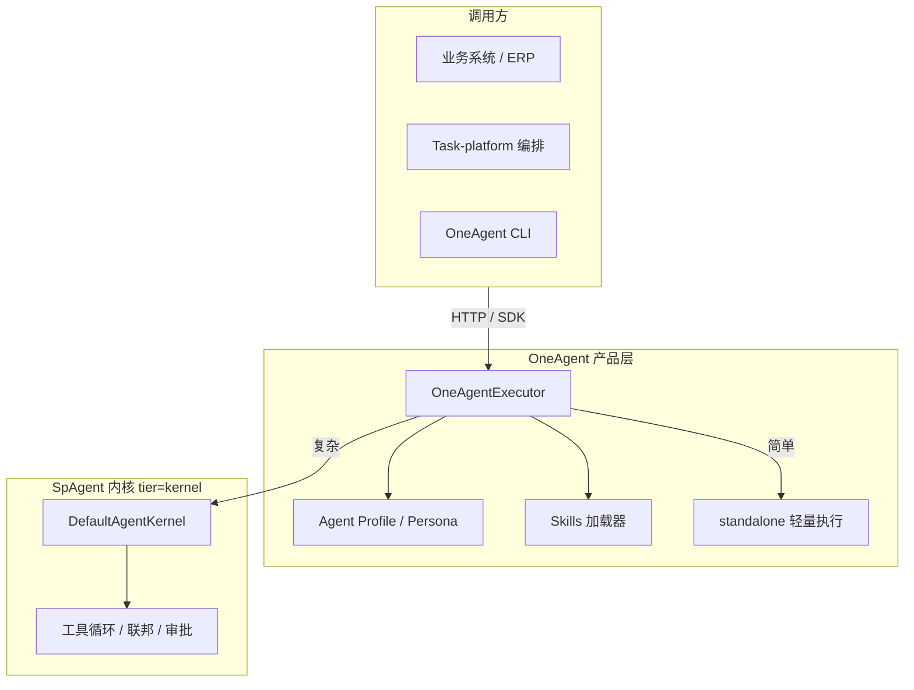
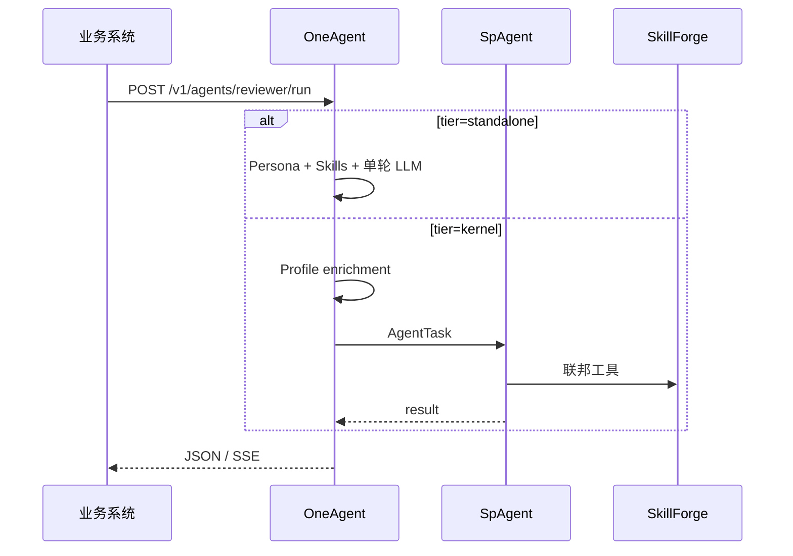

# OneAgent 方案设计

> **当前版本**：v0.1.0 · 内核依赖 [SpAgent](../SpAgent)（`core-agent` v0.2.0）

OneAgent 是 **可独立嵌入的 Copilot 式 Agent 组件**，同时作为 SpAgent 之上的产品层：简单场景自身处理，复杂场景委托 SpAgent 内核。

---

## 1. 定位与边界



| 层级 | 职责 | 不做 |
|------|------|------|
| **OneAgent** | 角色/Persona、Skills、执行路由、CLI/HTTP/SDK | 不重写 model↔tool 循环 |
| **standalone** | Persona + Skills + 单轮 LLM | 工具调用、多轮推理 |
| **SpAgent (kernel)** | 完整推理循环、策略、会话、checkpoint、联邦 | UI、业务 Persona |
| **宿主** | 鉴权、HostBridge 业务上下文、审批 UI | 内嵌 Agent 逻辑 |

**两种用法，同一入口**：

1. **独立 Agent 模块**：宿主嵌入 `createOneAgentRuntime`，简单任务 `tier=standalone` 即可，无需感知 SpAgent。
2. **Copilot 产品层**：复杂任务自动或手动 `tier=kernel`，由 SpAgent 处理工具循环与联邦外挂。

详见 [双轨执行架构](./双轨执行架构.md)。

---

## 2. 核心模块（已实现）

| 模块 | 路径 | 说明 |
|------|------|------|
| 执行路由 | `src/execution/` | `OneAgentExecutor`、tier 解析、standalone/kernel 分发 |
| 角色注入 | `src/persona/` | `PersonaContextPipeline` |
| Profile | `src/profile/` | YAML 加载、模板渲染、任务 enrichment |
| Skills | `src/skills/` | 本地 SKILL.md、Eager 注入、`skill_activate` |
| 宿主桥接 | `src/host/` | 默认 HostBridge + 可注入覆盖 |
| 运行时 | `src/bootstrap/` | 组装 SpAgent Kernel + OneAgent 层 |
| HTTP | `src/server/` | `/v1/agents/:id/run|stream`、`/v1/chat` |
| CLI | `src/cli/` | serve / run / chat / agents / skills |
| SDK | `src/client/` | `OneAgentClient` |

---

## 3. Agent Profile

角色单元，YAML 声明式配置。完整字段见 [AgentProfile规范](./AgentProfile规范.md)。

```yaml
apiVersion: oneagent.io/v1
kind: AgentProfile
metadata:
  id: reviewer
  name: 文档审阅助手
  version: "1.0.0"
spec:
  persona:
    system: |
      你是 {{tenant.name}} 的文档审阅专家，风格 {{style.tone}}。
    variables:
      style.tone:
        type: enum
        default: 严谨
        enum: [严谨, 友好]
  execution:
    defaultTier: standalone
    escalateToKernelWhen:
      hasContextRefs: true
  capabilities:
    allow: [knowledge_lookup, skill_activate]
    deny: [http_fetch]
  skills:
    autoLoad: [review-checklist, style-guide]
```

**内置 Agent**：

| id | defaultTier | 用途 |
|----|-------------|------|
| `copilot` | standalone | 通用辅助 |
| `reviewer` | standalone（有 contextRefs 升级 kernel） | 文档审阅 |
| `planner` | kernel | 任务规划 |

---

## 4. 角色注入链路

```text
① Profile 静态层    → persona.system 模板 + 默认能力集 + defaultTier
② Request 动态层    → agentId / personaOverrides / executionTier
③ HostBridge 业务层 → 宿主解析 contextRefs（ticket / document / PR 等）
```

---

## 5. Skills 体系

| 来源 | 格式 | 激活方式 | 状态 |
|------|------|---------|------|
| 本地 | `skills/*/SKILL.md` | Eager（autoLoad 注入 system） | ✅ |
| 本地 | 同上 | Lazy（`skill_activate` 工具） | ✅ |
| 远程 | SkillForge 联邦 | SpAgent bootstrap 加载 | ✅（需配置 federation） |

---

## 6. 部署模式

| 模式 | 配置 | 说明 |
|------|------|------|
| **Embedded** | `kernel.mode: embedded` | 单进程内嵌 SpAgent（默认） |
| **Sidecar** | `kernel.mode: sidecar` + `spagentUrl` | kernel tier 转发独立 SpAgent Gateway |

```bash
./scripts/start.sh    # 启动 HTTP :8790
./scripts/stop.sh
./verify.sh           # typecheck + test + smoke
```

---

## 7. 对外接入面

| 接入方式 | 状态 | 说明 |
|---------|------|------|
| HTTP API | ✅ | `POST /v1/agents/:id/run`，支持 `tier` |
| Node SDK | ✅ | `createOneAgentRuntime` + `runtime.executor` |
| HTTP Client SDK | ✅ | `OneAgentClient` |
| CLI | ✅ | `oneagent run/chat/serve` |
| MCP Server | ✅ | `oneagent mcp serve`（stdio） |
| Sidecar 流式 | ✅ | kernel tier 转发 SpAgent `/v1/tasks/stream` SSE |
| Subagent delegation | ✅ | `delegate_agent` 能力 + MCP `oneagent_delegate` |
| Python SDK | ⏳ | 可参考 HTTP 自行封装 |

接入细节见 [集成指南](./集成指南.md)。

---

## 8. 与 Compo 生态关系



| 组件 | 关系 |
|------|------|
| **SpAgent** | kernel tier 推理内核；standalone tier 复用其 ModelAdapter / SessionStore |
| **SkillForge** | 联邦 Skills（kernel tier） |
| **MemoAgent** | 跨会话记忆（kernel tier + federation） |
| **Task-platform** | 编排层 HTTP 调用 OneAgent |
| **compo-standards** | Header / 错误码 / manifest 风格对齐 |

---

## 9. 实施状态

### 已完成

- [x] 脚手架：package.json、start/stop/verify.sh
- [x] AgentProfile YAML 解析与校验
- [x] PersonaContextPipeline
- [x] 本地 SKILL.md + skill_activate
- [x] CLI（serve / run / chat / agents / skills / config）
- [x] Embedded 模式内嵌 SpAgent
- [x] HTTP API（/v1/agents、/v1/chat）
- [x] OneAgentClient SDK
- [x] 双轨执行（standalone / kernel / auto）
- [x] HostBridge 注入（`createOneAgentRuntime({ hostBridge })`）
- [x] Sidecar kernel 转发（基础）

### 待办（P2+）

- [ ] MCP HTTP 传输
- [ ] npm 公开发布 / Docker 镜像
- [ ] Subagent 链式深度限制 / 循环检测
- [ ] 多租户 Profile 隔离
- [ ] `oneagent skills sync`（远程 SkillForge）

---

## 10. 关键设计决策

| 决策 | 选择 | 理由 |
|------|------|------|
| 是否重写内核 | 否，依赖 SpAgent | 避免重复造 run-loop |
| 简单 vs 复杂 | 双轨 tier 路由 | 宿主可按场景选择或自动升级 |
| Profile 格式 | YAML | 与 compo manifest 一致 |
| 默认执行 | `auto` | Profile 声明 defaultTier + escalate 规则 |
| 嵌入方式 | SDK HostBridge 注入 | 宿主掌控业务上下文与审批 |

---

**总结**：OneAgent = **可独立嵌入的轻量 Copilot** + **SpAgent 之上的角色/Skills 产品层**。同一 `OneAgentExecutor` 入口，按 tier 在「自身单轮推理」与「SpAgent 完整循环」之间切换。
