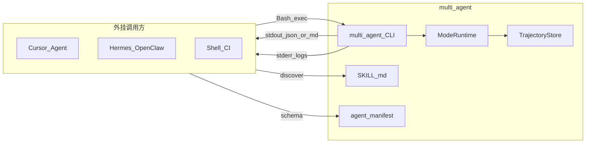

# multi-agent 产品设计规划

## 产品定位

**一句话：** 可被其他 Agent / IDE / 脚本调用的多模式协作运行时——先选协作模式，再交付结果。

| 维度 | 定义 |
|------|------|
| 仓库 | [`/Volumes/Lexar/git/02 POC/multi-agent`](/Volumes/Lexar/git/02%20POC/multi-agent) **独立产品仓** |
| 核心能力 | 完整实现 A 圆桌 / B 主控+专家 Consult / C Swarm(STORM) |
| 主入口 | **CLI 超级外挂**（对齐 [`CLI标准.md`](/Volumes/Lexar/git/12%20highvalue/架构设计/CLI标准.md)） |
| 辅入口 | 轻量 Web 演示台 |
| 首包 | NEV 技术包装 Skill Pack |
| 设计源 | 方法论 v1.1 + CLI 标准 v1.0.0 |

**与 agent-engine：** 仅知识嫁接，无运行时耦合。

---

## CLI 标准对齐（强制）

CLI 部分以 [`CLI标准.md`](/Volumes/Lexar/git/12%20highvalue/架构设计/CLI标准.md) 为验收真源；下表为产品侧落地决议。

| 标准条款 | multi-agent 落地 |
|----------|------------------|
| 语言 / 框架 | **Python ≥ 3.9 + Click**；`pyproject.toml` + `console_scripts` |
| 命令名 | **`multi-agent`**（kebab-case；禁止 `python main.py`） |
| 命令结构 | `<tool> <group> <action>` |
| 全局选项 | `--help` `--version` `-v/--verbose` `-q/--quiet` |
| 输出选项 | `--format table\|json\|markdown`（默认 table）；`-o/--output`；**`--demo`** |
| stdout / stderr | **数据 → stdout**；进度/日志 → **stderr** |
| Exit code | `0` 成功；`1` 通用错误；`2` 无交付/空结果；`3` 执行失败（LLM/子任务）；`130` 中断 |
| 配置优先级 | CLI 参数 > 环境变量 > `~/.multi-agent/config.yaml` / `./config.yaml` > 默认值 |
| Mock | `--demo` ≡ `MULTI_AGENT_MOCK_MODE=true` |
| 可离线验证 | 根目录 **`verify.sh` 必须**；help + version + 三模式 `--demo` + JSON 契约断言 |
| Agent 接入 | 根目录 **`SKILL.md` + `agent/manifest.json` 必须**（§15） |
| 文档 | README 含安装/快速开始/配置/verify；`guide/` 中文设计 |

**技术栈决议：** 核心运行时与 CLI **同仓 Python**（便于按标准打包与 Agent 发现）；Web 演示可用 Next.js，经 CLI/`runs/` 读结果，不反向污染 CLI 契约。

---

## 目标用户与调用拓扑



---

## 系统架构（不变）

ModeSelector → Roundtable / Consult / Swarm(STORM)；硬约束：唯一协调者、角色 schema、唯一 delivery、全量轨迹。详见方法论 §2。

---

## 命令设计（对齐 `<group> <action>`）

可执行名：`multi-agent`

```bash
# 全局
multi-agent --version
multi-agent --help

# 协作（主路径，agent_safe）
multi-agent run start --goal "..." --mode auto|roundtable|consult|swarm --pack nev-tech --format json --demo
multi-agent mode roundtable --topic "..." --pack nev-tech --rounds 2 --format markdown
multi-agent mode consult --goal "..." --pack nev-tech [--expert tech] --format json
multi-agent mode swarm --goal "..." --max-parallel 5 --format json

# 运行态
multi-agent run status <run_id> --format json
multi-agent run resume <run_id> --format json
multi-agent run trajectory <run_id> --format markdown

# 配置
multi-agent config init
multi-agent config show
```

| group | action | agent_safe | 说明 |
|-------|--------|------------|------|
| `run` | `start` | true | 统一入口（含 `--mode auto`） |
| `mode` | `roundtable` / `consult` / `swarm` | true | 显式模式 |
| `run` | `status` / `trajectory` | true | 只读 |
| `run` | `resume` | true | 非交互长任务续跑 |
| `config` | `init` / `show` | show=true；写密钥类=false | 按 §15 标注 |

长任务（swarm 大目标）：`manifest` 中 `agent_safe: "background_only"` 或提高 `timeout_sec`，并在 SKILL.md 标明可用 `sessions_spawn` / 勿前台死等。

### 废弃旧稿命名

不再使用短命令 `ma` 与 Node 包 `@multi-agent/cli`；对外契约以 `multi-agent` + CLI 标准为准。

---

## 输出契约（对齐标准 §6 / §10）

### stdout（`--format json` 终态信封）

```json
{
  "module": "mode-swarm",
  "version": "0.1.0",
  "data_source": "demo",
  "fetched_at": "2026-07-15T10:00:00+08:00",
  "run_id": "…",
  "mode": "swarm",
  "coordinator": "orchestrator",
  "delivery": { "title": "…", "body_markdown": "…", "artifacts": [] },
  "warnings": []
}
```

| 字段 | 必须 | 说明 |
|------|------|------|
| `module` | ✓ | 子命令标识，如 `run-start` / `mode-consult` |
| `data_source` | ✓ | `live` \| `demo` \| `cache` |
| `delivery` | ✓ | 唯一对调用方的交付面 |
| `run_id` | ✓ | 可 `run status` / `trajectory` |
| `fetched_at` | 推荐 | ISO8601 |
| `warnings` | 可选 | 非致命问题 |

- `--format table`：人类可读摘要（默认）
- `--format markdown`：交付正文优先（Agent 摘要友好）
- `-o path`：写入文件；未指定则 stdout
- **进度与步骤日志 → stderr**（含 `run_id`）；需要事件流时可用 `--verbose` 打 DEBUG，或后续加 `--events jsonl` 仍约定「仅事件可走 stdout、日志 stderr」并在 SKILL 写清

### Exit code 语义（协作任务映射）

| Code | 含义 |
|------|------|
| 0 | 成功且有 delivery |
| 1 | 参数/配置错误、未捕获异常 |
| 2 | 跑通但无有效交付（空聚合/用户取消产出） |
| 3 | 模式执行失败（LLM、子 Agent、并行超时耗尽） |
| 130 | Ctrl+C |

---

## Agent 超级外挂接入（标准 §15）

必须交付：

1. **`SKILL.md`**：Frontmatter（`cli_command: multi-agent`、`agent_safe_commands`、`human_required_commands`）+ Agent 推荐命令（完整 bash、exit code、JSON 字段）+ 禁止项 + stdout/stderr 说明  
2. **`agent/manifest.json`**：命令 Schema、`cli_template`、`agent_safe`、`timeout_sec`、`exit_codes`、`definitions` 绑定上节 JSON 信封  

Cursor / Hermes / OpenClaw 通过读 Skill + 执行 shell 零配置调用；MCP 路径以 manifest 为注册源。

---

## 仓库结构（CLI 标准模板 + 产品核心）

```text
multi-agent/                    # 产品仓（可对外也称 multi-agent-CLI 实践）
├── pyproject.toml              # console_scripts: multi-agent = multi_agent.cli:main
├── README.md
├── verify.sh                   # 必须：version/help/--demo 三模式 + JSON 契约
├── .env.example
├── config.yaml.example
├── SKILL.md                    # 必须
├── agent/
│   └── manifest.json           # 必须
├── guide/                      # 产品定位、架构、模式映射
├── scripts/
│   ├── start.sh                # Web/守护可选
│   └── stop.sh
├── tests/                      # pytest；含 --demo 链路
├── multi_agent/                # Python 包
│   ├── __init__.py
│   ├── __version__.py
│   ├── cli.py                  # 唯一 Click 入口
│   ├── config.py
│   ├── modes/                  # roundtable / consult / swarm(STORM)
│   ├── selector.py             # ModeSelector §2.5
│   ├── skill_packs/nev_tech/
│   ├── llm/                    # live + demo mock
│   ├── trajectory/
│   ├── sdk.py                  # Python 可编程 API（镜像 CLI 语义）
│   └── utils/{logger,errors}.py
├── runs/                       # gitignore：run 产物与轨迹
└── apps/web/                   # M3：只读演示（可选）
```

配置：`~/.multi-agent/config.yaml`；环境变量前缀 `MULTI_AGENT_*`（如 `MULTI_AGENT_MOCK_MODE`、`MULTI_AGENT_API_KEY`）。

---

## 三种模式产品化（CLI 命令已对齐）

| 模式 | CLI | DoD |
|------|-----|-----|
| A 圆桌 | `multi-agent mode roundtable ...` | Master Plan + 轮次轨迹 |
| B Consult | `multi-agent mode consult ...` | 主控统一交付 + consult IO 可审计 |
| C Swarm | `multi-agent mode swarm ...` | STORM + Critical Path + 聚合 delivery |
| Auto | `multi-agent run start --mode auto ...` | 选型可观测（stderr + JSON `mode` 字段） |

嵌套与方法论 §2.5 / §2.6 不变。

---

## 关键用户旅程（更新命令名）

1. `multi-agent mode swarm --goal "对比三家固态电池供应链" --format json --demo`
2. `multi-agent mode roundtable --topic "参数内卷下如何推" --pack nev-tech --format markdown`
3. `multi-agent mode consult --goal "半固态电池包装成抖音脚本" --pack nev-tech --format json`
4. `multi-agent run start --goal "..." --mode auto --format json`
5. `multi-agent run trajectory <run_id> --format markdown`

---

## 里程碑与 DoD

| 阶段 | 范围 | 完成即什么 |
|------|------|------------|
| **M0** | pyproject、Click 入口、logger(stderr)、exit code、`--demo`、verify.sh、SKILL/manifest 骨架 | `./verify.sh` 离线通过；`--version/--help` 可用 |
| **M1** | 三模式 + ModeSelector + nev-tech + JSON 信封 | 三模式 `--demo --format json` 契约字段齐 |
| **M2** | status/resume/trajectory、config、sdk.py、分片/handoff、manifest agent_safe 齐全 | 外部 Agent 仅凭 SKILL 可调用 |
| **M3** | Web 只读 + live LLM + start/stop | 演示检查清单可勾选 |

**非目标：** 100 并发 Kimi Swarm、企业多租户、整迁 Agent共创平台。

---

## 文档与验证

- `guide/产品定位与模式映射.md`
- `guide/CLI与标准对齐说明.md`（对照 CLI标准章节清单）
- `guide/架构总览.md`
- `verify.sh`：install → version/help → 三模式 `--demo` → JSON 字段断言 → `pytest -q`

---

## 实现优先级结论

1. **CLI 标准契约优先于 Web / TS 习惯**（Python Click 为外挂真源）  
2. **SKILL.md + manifest 与三模式同里程碑交付**（无文档不算超级外挂）  
3. **`--demo` / Mock 第一天进主路径**，保证 verify 零外网  
4. 三模式同权；STORM（C）深度优先补方法论缺口
