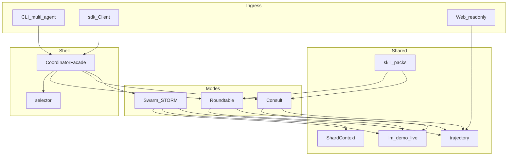

# 架构总览



## 包职责

| 模块 | 职责 |
|------|------|
| `cli.py` | Click 唯一入口 |
| `coordinator.py` | 选型与 handoff |
| `modes/` | A/B/C Runtime |
| `llm/` | demo / live |
| `trajectory/` | runs 落盘 |
| `sdk.py` | 可编程外挂 |
| `apps/web` | 只读浏览 runs（stdlib HTTP） |

## 运行产物

```
runs/<run_id>/
  trajectory.md
  result.json
  delivery.md
  state.json
```
